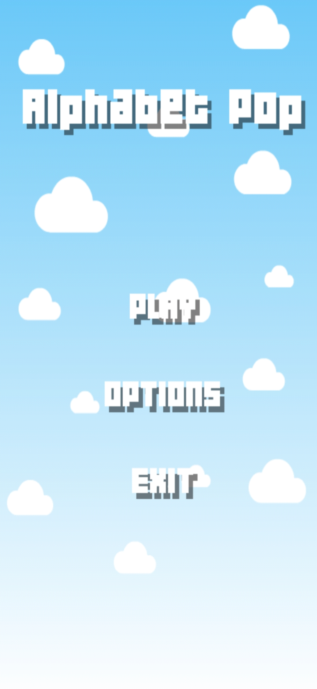
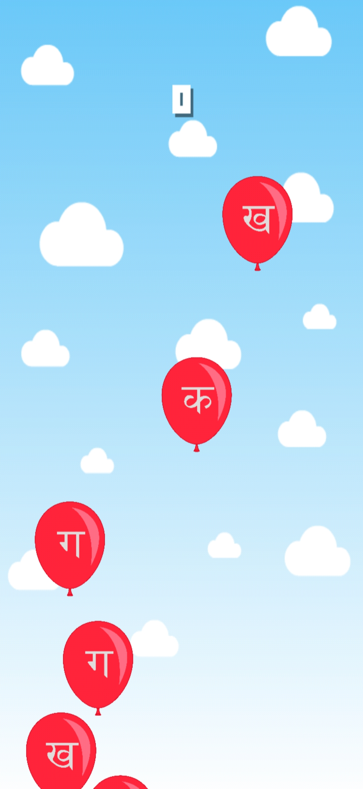
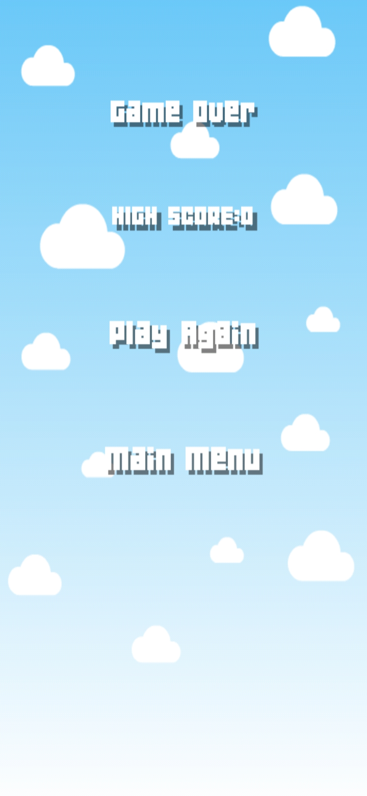
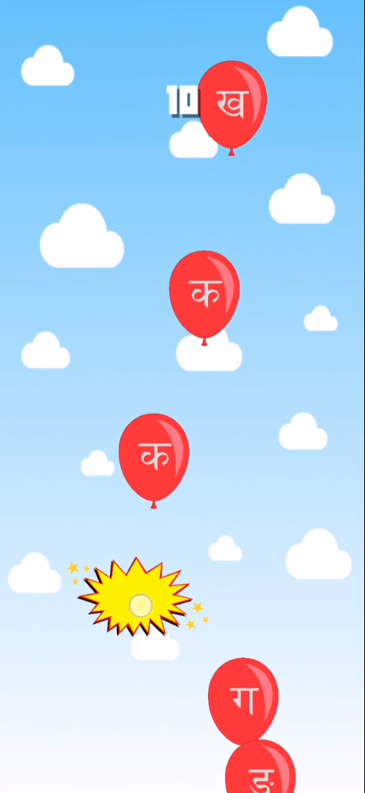

# Alphabet Balloon
>Alphabet Balloon : A children friendly game developed in Unity to teach them alphabets of Nepali Language.

This is a interactive, children friendly game which I developed using Unity where the player have to tap on the balloon containing the alphabet which is played.

  
  
